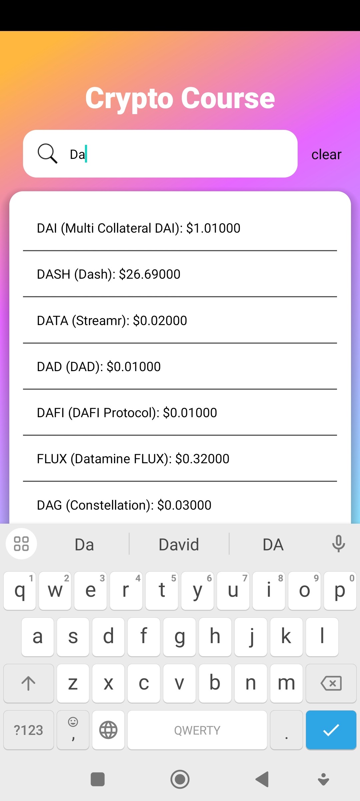
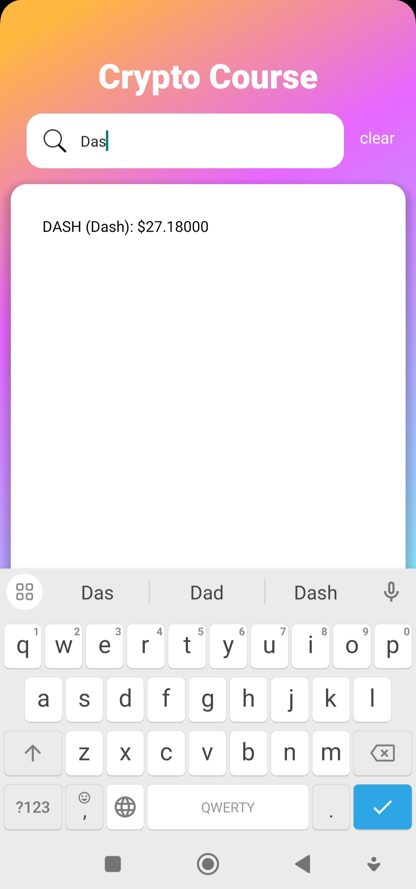
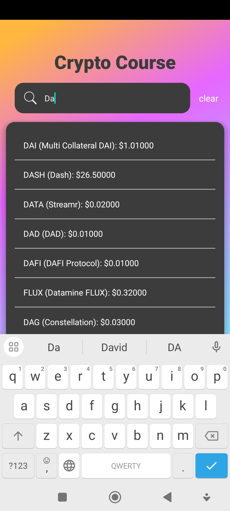
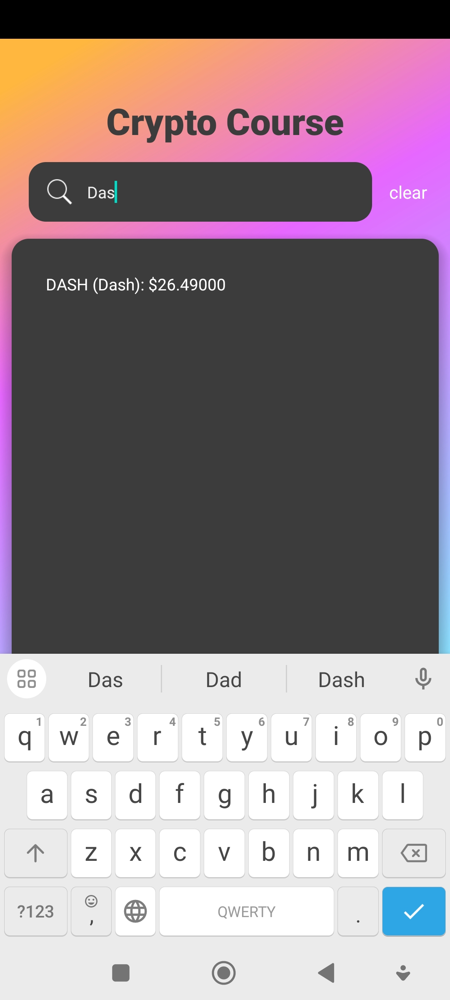
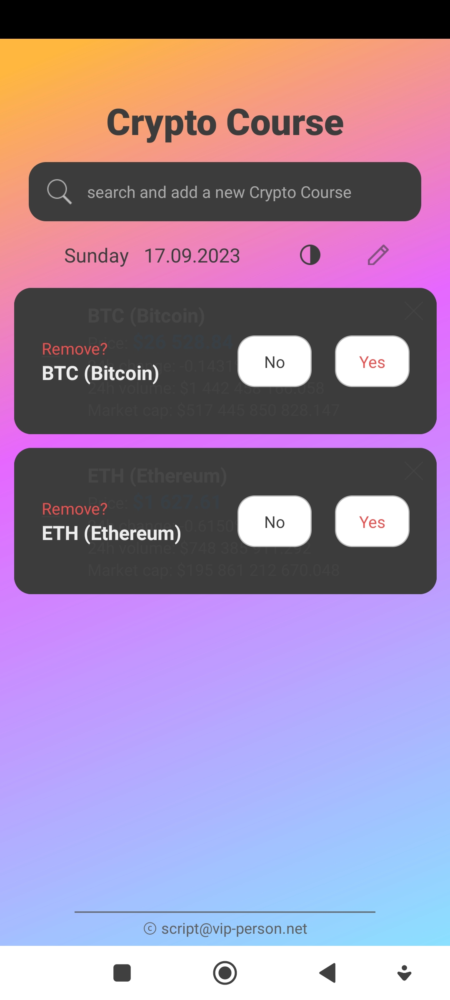

# Crypto Course

(React Native, Expo, TypeScript, Metro, EAS (CI), WebSocket, Eslint, Prettier, Babel)

- [Download .apk build (android, 26.0 MB)](https://github.com/Aleksandr-JS-Developer/crypto-course/releases/download/2.0.2/android-build.v2.0.2.apk)

<p float="left">
  
  
  
  <br />
  
  
  
  <br />
  
  
  
  <br />
  
  
  
</p>

---

## Installation

```bash
npm install
```

## Run in dev mode

```bash
npm start
```
