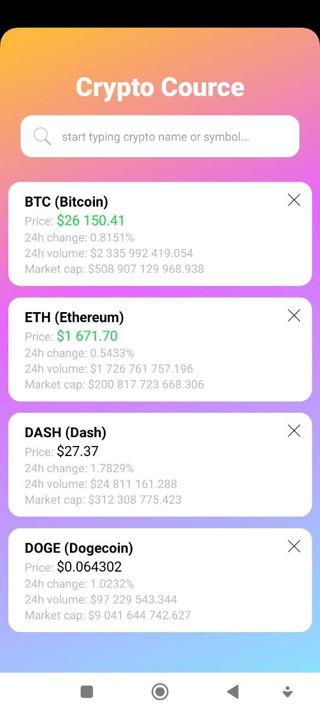

# Crypto Cource

(react-native, expo, typescript, metro, eas (CI), WebSocket, eslint, prettier, babel)

- [Download .apk build (android, 25.4 MB)](https://github.com/Aleksandr-JS-Developer/crypto-cource/releases/download/1.2.4/android-build-stable.v1.2.4.apk)



---

## Installation

```bash
npm install
```

## Run in dev mode

```bash
npm start
```
